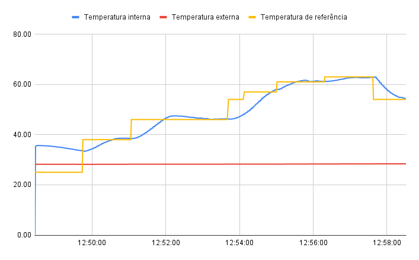

# Trabalho 1 - FSE 2021-2
Repositório referente ao Trabalho 1 da disciplina de Fundamentos de Sistemas Embarcados. A descrição do trabalho pode ser encontrada em: https://gitlab.com/fse_fga/trabalhos-2021_2/trabalho-1-2021-2.

## Compilação
Após clonar o repositório, para compilar e executar, utilize os seguintes comandos na pasta raíz:
```
make
make run
```

## Uso
Ao iniciar o programa serão solicitados os 4 últimos dígitos da matrícula do usuário. Em seguida será apresentado um menu com algumas opções. Para navegar no menu é necessário digitar o número correspondente a opção desejada.

### Opções do menu
- **Aguardar acionamento do forno:** Coloca o programa em modo de espera para aguardar que o usuário ligue o forno, iniciando o controle da temperatura.
Quando o forno for desligado, o usuário terá a opção de retornar ao menu inicial ou continuar aguardando até que o forno seja ligado novamente.
- **Alterar temperatura de referência:** Permite ativar o modo de terminal, definindo a temperatura de referência que será utilizada quando o forno for ligado. Se a temperatura definida for -1 o modo de terminal será desligado e o sistema iniciará no modo de potenciômetro.
- **Alterar parâmetros do PID:** Permite alterar os parâmetros Kp, Ki e Kd do PID.
- **Mostrar valores atuais:** Permite visualizar quais são os valores definidos no momento para a matrícula, a temperatura de referência (-1 significa que o modo de terminal está desativado) e os parâmetros do PID.

## Experimentos
 
### Potenciômetro

#### Temperaturas


#### Sinal de controle


### Curva de temperatura

#### Temperaturas


#### Sinal de controle

